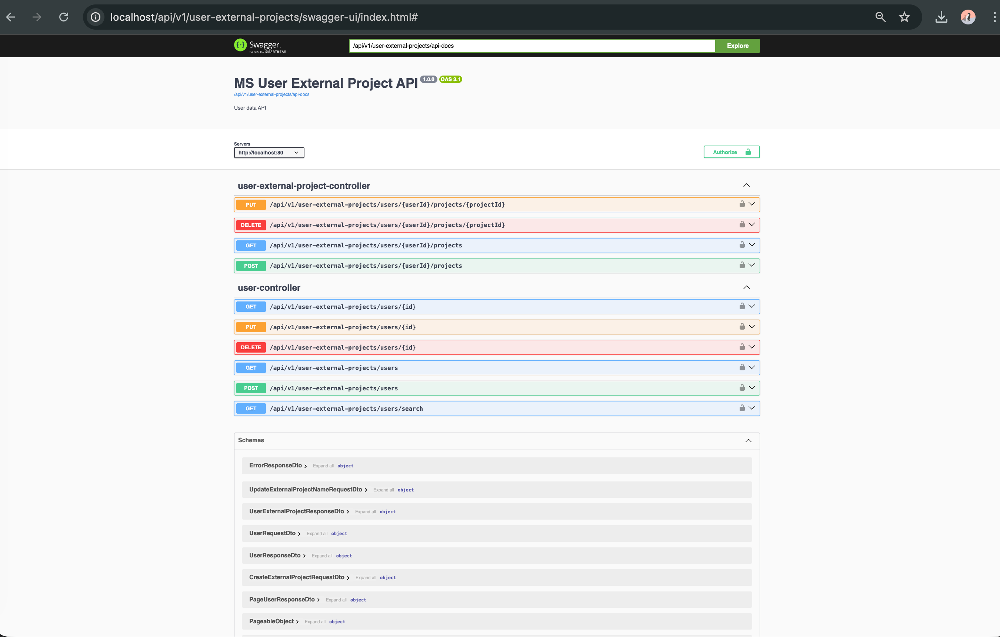
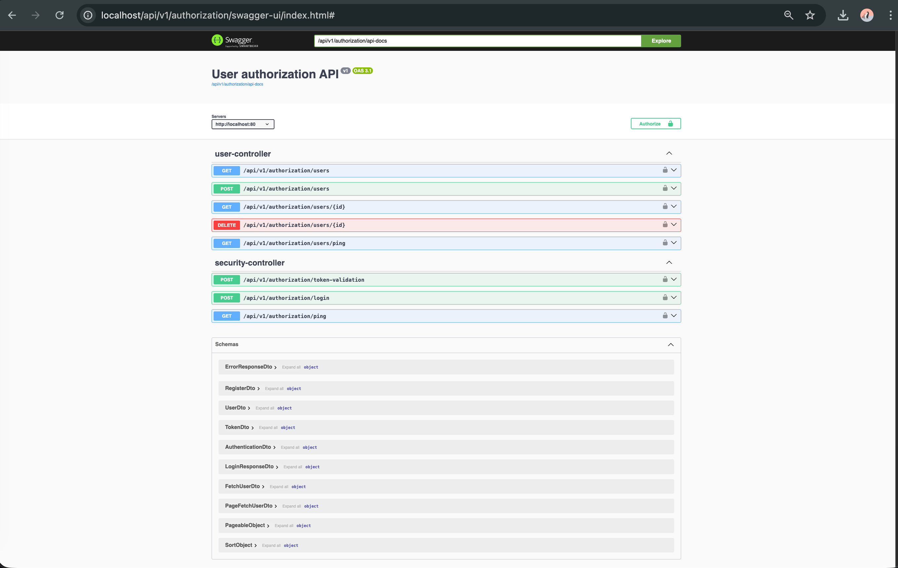
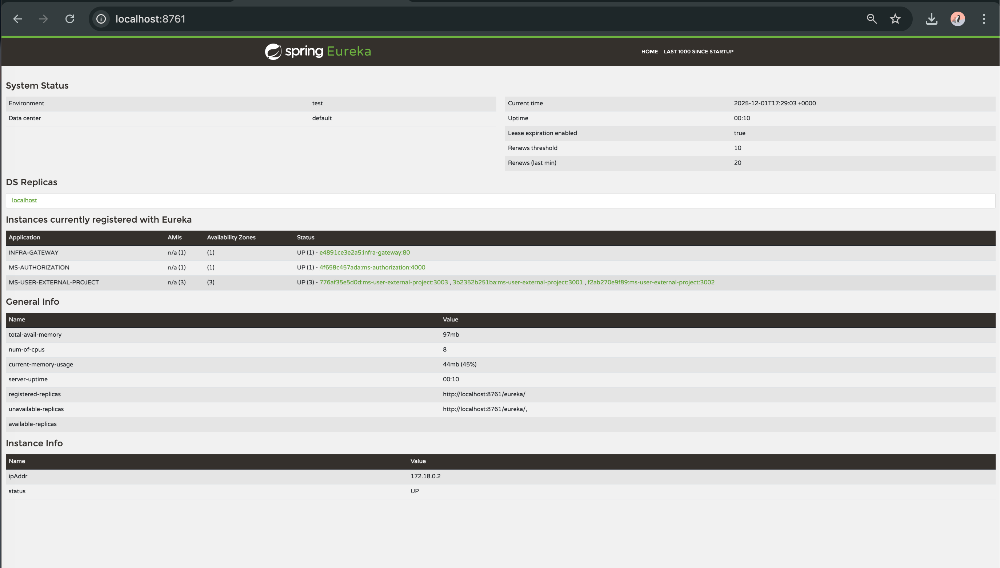
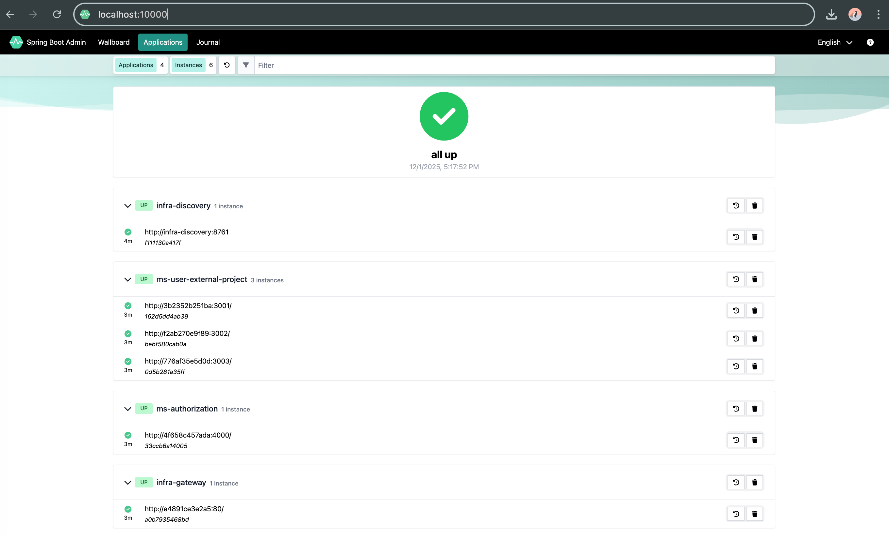
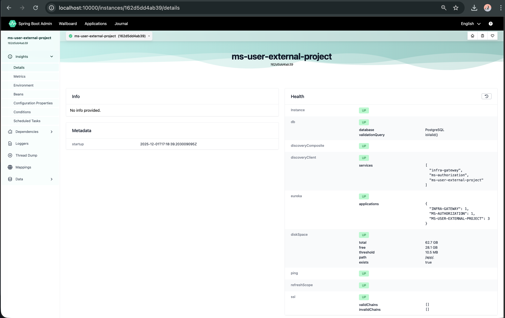
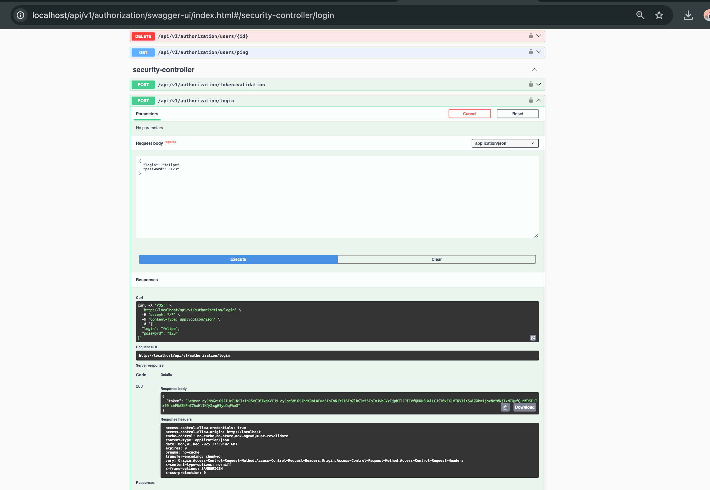
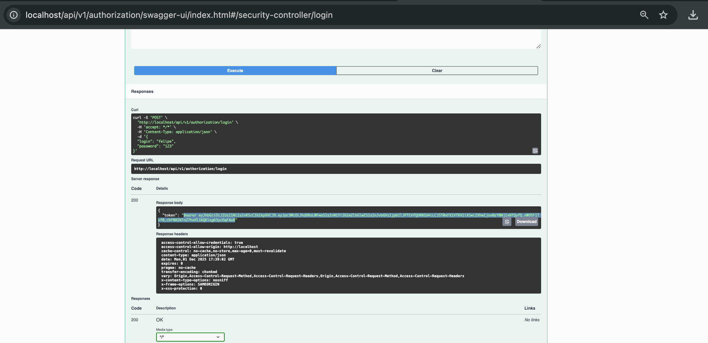
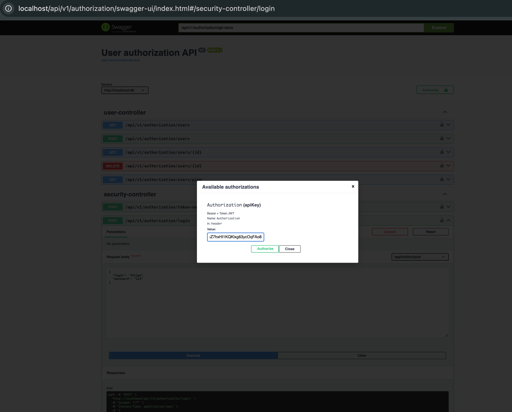
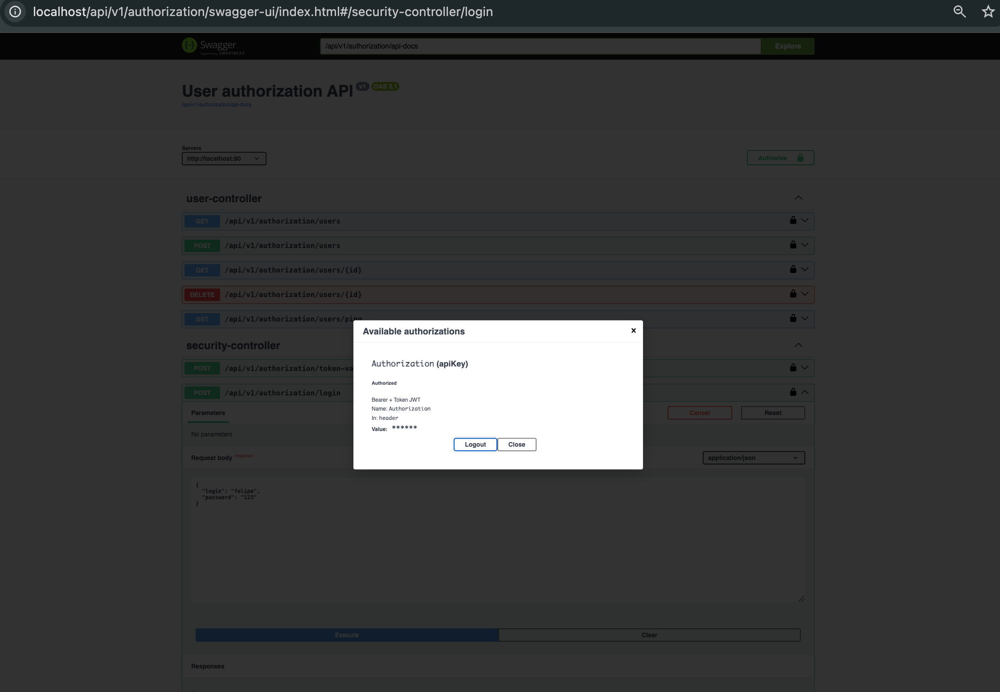

# Sky-back-end

This project provides a unified architecture with:

- **Eureka Server** for service discovery
- **Spring Cloud Gateway** as the entry point
- **Authentication Service (ms-authentication)**
- **User External Project Service (ms-user-external-project)**
- **Spring Boot Admin** for monitoring and health visualization
- **PostgreSQL databases**
- **Docker Compose infrastructure**

Only User External Project Service and  Authentication Service run through the gateway:
```
http://localhost:80
```

---

## 📘 Swagger Documentation (via Gateway)

Use these URLs to access the Swagger UI for each microservice:

### User External Projects API
```
http://localhost/api/v1/user-external-projects/swagger-ui/index.html#
```


### Authentication API
```
http://localhost/api/v1/authorization/swagger-ui/index.html#
```

---

# 🏛 Architecture Overview

```mermaid
    Client --> Gateway

    Gateway --> Auth[ms-authentication]
    Gateway --> UserExternal[ms-user-external-project]

    Auth --> PGAuth[(PostgreSQL - Auth DB)]
    UserExternal --> PGUser[(PostgreSQL - User DB)]

    Auth <-->|Service Discovery| Eureka
    UserExternal <-->|Service Discovery| Eureka
    Gateway <-->|Service Discovery| Eureka

    Admin[Spring Boot Admin] <-->|Monitoring & Metrics| Auth
    Admin <-->|Monitoring & Metrics| UserExternal
    Admin <-->|Discovery| Eureka
```

---

# 🚀 Services Included

### **1. Eureka Server**
Central registry for automatic service discovery. Use http://localhost:8761



### **2. Spring Cloud Gateway**
Single entry point for all API routing through port **80**.

### **3. ms-authentication**
Handles:
- Login & JWT issuing
- Token validation
- Admin operations for user creation, deletion, and listing

### **4. ms-user-external-project**
Handles:
- User CRUD
- Linking users to external projects
- Updating or removing linked projects

### **5. Spring Boot Admin**
Provides:
- Central dashboard to monitor all registered Spring Boot applications
- Health status and actuator endpoints visualization
- Instance status, metrics, environment, and logging views

All microservices are configured to register with **Eureka**, and **Spring Boot Admin** uses the registry to discover and monitor them.

* Dashboard view:



* Metrics view:



### **6. PostgreSQL Databases**
Each microservice has its own isolated database:
- `authdb`
- `userdb`

---

# 📎 Gateway Routing

All requests must go through:

```
http://localhost:80/api/v1/
```

| Service | Gateway Prefix |
|---------|----------------|
| Authentication Service | `/api/v1/authorization/...` |
| User External Project Service | `/api/v1/user-external-projects/...` |

---

# 📚 Main Endpoints

## **ms-authentication**

| Method | Endpoint | Description | Role |
|-------|----------|-------------|------|
| POST | `/authorization/login` | Authenticate and receive JWT | Public |
| POST | `/authorization/token-validation` | Validate JWT token | Public |
| POST | `/authorization/users` | Register new user | ADMIN |
| DELETE | `/authorization/users/{id}` | Delete user | ADMIN |
| GET | `/authorization/users` | Paginated list of users | ADMIN |
| GET | `/authorization/users/{id}` | Get user by ID | ADMIN |

---

## **ms-user-external-project**

### Users

| Method | Endpoint | Description | Roles |
|-------|----------|-------------|--------|
| GET | `/user-external-projects/users` | List all users | ADMIN, USER |
| GET | `/user-external-projects/users/{id}` | Get user by ID | ADMIN, USER |
| GET | `/user-external-projects/users/search?email=` | Find user by email | ADMIN, USER |
| POST | `/user-external-projects/users` | Create user | ADMIN, USER |
| PUT | `/user-external-projects/users/{id}` | Update user | USER |
| DELETE | `/user-external-projects/users/{id}` | Delete user | ADMIN |

### User External Projects

| Method | Endpoint | Description |
|--------|----------|-------------|
| GET | `/users/{userId}/projects` | List all external projects for user |
| POST | `/users/{userId}/projects` | Add a new external project |
| PUT | `/users/{userId}/projects/{projectId}` | Update project name |
| DELETE | `/users/{userId}/projects/{projectId}` | Remove project |

---

# 🐳 Running Everything with Docker Compose

To start all services:

```bash
docker-compose up --build
```

### Useful URLs After Startup

| Service | URL                                                                  |
|---------|----------------------------------------------------------------------|
| API Gateway | http://localhost:80                                                  |
| Eureka Dashboard | http://localhost:8761                                                |
| Swagger – User External Projects | http://localhost/api/v1/user-external-projects/swagger-ui/index.html |
| Swagger – Authentication | http://localhost/api/v1/authorization/swagger-ui/index.html          |
| Spring Boot Admin | _http://localhost:10000_                                             |

---

# 📁 Project Structure

```
/
├── eureka-server
├── gateway
├── ms-authentication
├── ms-user-external-project
├── spring-boot-admin        # (example folder for the Admin server)
├── docker-compose.yml
└── README.md
```

# 📁 Default user - Important!

```
    You can use this default user to login e generate tokens, or create your own user:
    user: felipe
    pass: 123
```





---

# ✔️ Prerequisites

- Docker & Docker Compose
- Java 17+
- Maven
- IntelliJ IDEA (optional)

---